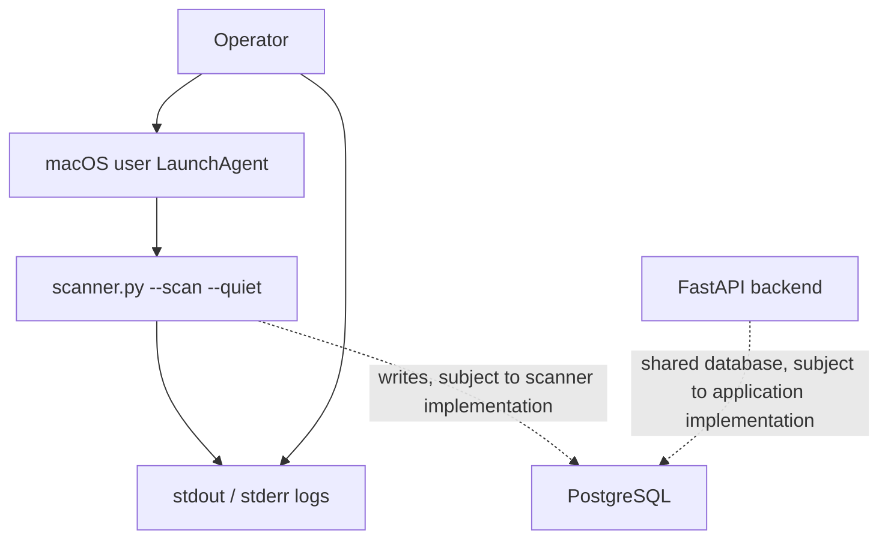

# Scanner-Cleaner

macOS `launchd` automation for **proxy-inspector**. Runs `scanner.py --scan --quiet` on a 300-second (5-minute) interval, independently of the FastAPI server.

This package includes a LaunchAgent plist and install/uninstall scripts. **It does not include `scanner.py`, Python dependencies, or database setup.** It adds scheduling; it does not implement cleanup or deletion.

## Project purpose

Scanner-Cleaner provides a repeatable way to schedule an existing security scanner on a personal Mac or authorized lab workstation. Its goal is to make collection independent of the API's lifecycle and give the operator a consistent place to inspect failures.

The broader proxy-inspector project is described as a network security tool. This archive supplies the automation layer only; actual detection rules, supported targets, scan output, and database schema require review of the scanner source.

## Capabilities and project status

| Capability | Status in this package |
| --- | --- |
| Scheduled command execution | Configured every 300 seconds |
| Run on agent load | Enabled through `RunAtLoad` |
| API-independent process | Configured as a separate user LaunchAgent |
| Persistence across login sessions | Plist installed in `~/Library/LaunchAgents`; execution requires a user session |
| stdout and stderr capture | Configured as separate files |
| Database writes and detection logic | Delegated to external `scanner.py`; not verified here |
| Automatic blocking, quarantine, or cleanup | Not implemented by this package |
| Alerts, dashboard, retention, or audit trail | Not implemented by this package |
| Automated macOS integration tests | Not included |

**Status:** small automation package with machine-specific defaults. It needs configuration and local verification before use. No macOS version compatibility matrix or production validation is supplied.

## Architecture



Solid arrows represent the scheduling and logging arrangement configured by this package. Dashed arrows represent the intended external application integration, which must be checked against proxy-inspector's source.

## Contents

- [Project purpose](#project-purpose)
- [Capabilities and project status](#capabilities-and-project-status)
- [Before installing](#before-installing)
- [Install](#install)
- [Verify](#verify)
- [Change the schedule or configuration](#change-the-schedule-or-configuration)
- [Security and data handling](#security-and-data-handling)
- [Operational acceptance checks](#operational-acceptance-checks)
- [Troubleshooting](#troubleshooting)
- [Uninstall](#uninstall)
- [Development roadmap](#development-roadmap)
- [Contributing](#contributing)

## How it works

The installer copies `com.alexh.proxyinspector.scanner.plist` into `~/Library/LaunchAgents` and registers it in your user's GUI session. `RunAtLoad` requests a scan when the agent is loaded; `StartInterval` requests subsequent runs every 300 seconds.

Use this user LaunchAgent from a logged-in macOS account, without `sudo`. Scans cannot execute while the Mac is asleep; this is not an exact wall-clock schedule.

The scanner remains responsible for database writes. The FastAPI server can be stopped, but services and configuration required by `scanner.py` must still be available. Its source is not included, so PostgreSQL behavior cannot be verified from this package.

## Package contents

| File | Purpose |
| --- | --- |
| `com.alexh.proxyinspector.scanner.plist` | Command, interval, working directory, and log paths |
| `scripts/install.sh` | Copies and registers the LaunchAgent |
| `scripts/uninstall.sh` | Unregisters the agent and removes the installed plist |

## Before installing

Set up proxy-inspector and confirm that a manual scan succeeds. Check all paths against your Mac: the supplied files currently use `/Users/alexhernandezm/Downloads/proxy-inspector`.

| Location | What to check or change |
| --- | --- |
| Plist: first `ProgramArguments` entry | Python executable; currently `/usr/bin/python3` |
| Plist: second `ProgramArguments` entry | Absolute path to `scanner.py` |
| Plist: `WorkingDirectory` | Absolute path to proxy-inspector |
| Plist: `StandardOutPath` and `StandardErrorPath` | Absolute paths to log files |
| Installer: `mkdir -p` line | The same log directory used by the plist |

Use absolute paths in the plist, rather than `~` or `$HOME`. If you relocate the project, update **both the plist and the installer**.

If your scanner uses a virtual environment, replace `/usr/bin/python3` with its absolute Python path, such as `/Users/alexhernandezm/Downloads/proxy-inspector/.venv/bin/python`.

`launchd` does not activate your virtual environment or run your interactive shell startup files. This package defines no environment variables and does not load a `.env` file; whether `.env` works depends on `scanner.py`. Make its required configuration available outside your interactive shell.

With the supplied paths and interpreter, test manually:

```bash
cd /Users/alexhernandezm/Downloads/proxy-inspector
/usr/bin/python3 scanner.py --scan --quiet
```

Substitute your chosen interpreter and project path if you changed them. Resolve scan or database errors before installing.

## Install

From the directory containing this README, after checking the configuration:

```bash
mkdir -p "$HOME/Library/LaunchAgents"
chmod +x scripts/install.sh scripts/uninstall.sh
plutil -lint com.alexh.proxyinspector.scanner.plist
./scripts/install.sh
```

The installer creates the configured log directory, copies the plist, removes any loaded job with the same label, then bootstraps and enables it. It does not install dependencies or start PostgreSQL. The script does not create `~/Library/LaunchAgents`, so keep the first command above.

## Verify

Inspect the registered agent:

```bash
launchctl print "gui/$(id -u)/com.alexh.proxyinspector.scanner"
```

For a compact listing:

```bash
launchctl list | grep -F com.alexh.proxyinspector.scanner
```

A registered job is not proof that a scan succeeded. It may be idle between runs, so a continuously running PID is unnecessary. Check its last exit status, stderr, and the results produced by the scanner.

With the default paths, inspect both logs:

```bash
tail -n 100 "$HOME/Downloads/proxy-inspector/logs/scanner.out.log"
tail -n 100 "$HOME/Downloads/proxy-inspector/logs/scanner.err.log"
```

To follow both logs, press `Ctrl+C` when finished:

```bash
tail -f "$HOME/Downloads/proxy-inspector/logs/scanner.out.log" \
        "$HOME/Downloads/proxy-inspector/logs/scanner.err.log"
```

Adjust these paths if you changed the plist. With `--quiet`, an empty stdout log alone does not establish success or failure.

## Change the schedule or configuration

Edit `StartInterval` in the source plist; its value is in seconds:

```xml
<key>StartInterval</key>
<integer>300</integer>
```

For example, `600` requests scans every 10 minutes. Set `RunAtLoad` to `<false/>` to omit the scan requested when the job loads.

After editing the source configuration, validate and reinstall:

```bash
plutil -lint com.alexh.proxyinspector.scanner.plist
./scripts/install.sh
```

The installed plist is a copy; editing the source alone does not update the registered job. Reinstalling unregisters the existing job and may interrupt an active scan, so do it when a scan is not running.

## Security and data handling

These are operating recommendations; this package does not enforce them.

- Limit scans to devices and networks you own or have permission to assess. Review the scanner's targets before enabling recurring execution.
- Run under a regular user account. Grant database permissions only for operations the scanner actually needs; avoid database administrator credentials.
- Keep passwords, tokens, connection strings, `.env` files, and real scan exports out of Git. Use the scanner's supported configuration mechanism and restrict access to secret files.
- Exclude credentials from logs. Treat network identifiers and scan findings as sensitive; restrict access to logs, exports, and database records.
- Choose a retention period and arrange log rotation. This package does not expire records or limit log sizes.
- Review findings before acting. Scheduling a scan does not establish detection accuracy, and this package does not remediate findings.

See the OWASP references below for secrets, database permissions, and logging guidance.

## Operational acceptance checks

Run these checks on your Mac before relying on recurring scans. These are manual acceptance criteria, not completed test results.

| Check | Evidence to collect |
| --- | --- |
| Manual execution | The configured Python interpreter runs a scan successfully from the configured working directory. |
| Plist validity | `plutil -lint` reports a valid plist. |
| Installation | `launchctl print` finds the job under your GUI user domain. |
| Scheduled execution | Observe a later scan without manually launching it; check output or scanner-owned timestamps. |
| API independence | Stop the FastAPI process while leaving scanner dependencies available; confirm a later scan still completes. |
| Database integration | If the scanner persists results, confirm a new run in its actual schema; no table names are assumed here. |
| Failure visibility | In an isolated lab, use a recoverable configuration failure and verify it is visible in status or stderr; restore configuration afterward. |
| Login persistence | Log out and back in, then verify the agent loads and scanning resumes. |
| Removal | Uninstall and verify the service is no longer registered. |

Record macOS version, Python version, relevant dependency versions, configuration choices, timestamps, and outcomes. Redact credentials and sensitive targets before sharing evidence.

A useful demonstration shows a manual scan, a scheduled scan, a scan while the API is stopped, and an observable failure. Avoid using a clean stdout log as the sole proof.

## Troubleshooting

| Symptom | Checks and next action |
| --- | --- |
| Copy fails during install | Create `~/Library/LaunchAgents` using the install command above. |
| Bootstrap fails | Validate the plist; check executable/project/log paths and permissions; use your logged-in GUI account without `sudo`. |
| `ModuleNotFoundError` | Use the Python interpreter containing scanner dependencies, then reinstall. |
| Manual scan works; scheduled scan fails | Compare interpreters, working directory, and configuration available outside your shell; read stderr. |
| Database connection errors | Verify database availability and scanner credentials/configuration; this package does not start the database. |
| Empty logs or missing results | Inspect agent status, stderr, and scanner results; `--quiet` may suppress stdout. |
| Permission denied for Downloads files | Check file permissions and macOS privacy settings for the scheduled process. |
| Logs keep growing | Arrange log rotation or maintenance; this package has no log rotation. |

For commands and keys supported by your installed macOS version:

```bash
man launchctl
man launchd.plist
```

## Uninstall

From this package directory:

```bash
./scripts/uninstall.sh
```

The script attempts to unload the job and deletes `~/Library/LaunchAgents/com.alexh.proxyinspector.scanner.plist`. It leaves the project, logs, and database data in place. It suppresses unload errors, so verify removal:

```bash
launchctl print "gui/$(id -u)/com.alexh.proxyinspector.scanner"
```

After successful removal, that command should report that the service cannot be found.

## Development roadmap

The following items are proposed work, not shipped features.

| Priority | Improvement | Completion evidence |
| --- | --- | --- |
| 1 | Portable installer | Accept project and Python paths, generate the installed plist, create required directories, and validate prerequisites before replacing an existing job. |
| 2 | Inspect the scanner contract | Document actual configuration, targets, exit codes, database schema, and output using `scanner.py` and its dependencies. |
| 3 | Reliable run records | Add run identifiers, start/end timestamps, duration, outcome, and useful errors; avoid recording secrets. |
| 4 | Resource and failure controls | Define scan timeouts, bounded retries, and concurrency behavior across manual and scheduled runs. |
| 5 | Retention and recovery | Implement log rotation, documented database retention, and tested recovery procedures. |
| 6 | Findings workflow | Add evidence-backed severity, duplicate handling, and optional alerts after reviewing real detection output. |
| 7 | Release validation | Add macOS install/reinstall/uninstall checks and record the tested OS and interpreter matrix. |

The next practical implementation step is the portable installer: it removes the current dependency on one username and makes the existing package easier to run. Scanner-level work requires the actual proxy-inspector source.

## Contributing

Keep changes focused and include the problem, expected behavior, and verification evidence. Use synthetic or redacted examples when reporting bugs. For installer changes, verify first install, reinstall, alternate project paths, missing dependencies, and uninstall on macOS.

Report issues with macOS and Python versions, the command that failed, relevant exit status, and redacted stderr. Do not publish credentials or sensitive scan findings in a public issue. No private vulnerability-reporting contact has been configured in this package.

## License

This archive contains no license file. Choose and add an explicit license before presenting the repository as licensed open-source software.

## Commit the README

If this directory is part of your Git checkout:

```bash
git diff -- README.md
git add README.md
git commit -m "Improve scanner automation setup and troubleshooting docs"
git push origin main
```

The push command assumes your intended branch is `main` and your remote is `origin`. This ZIP contains no Git history or remote configuration.

## References

- [Apple: Creating Launch Daemons and Agents](https://developer.apple.com/library/archive/documentation/MacOSX/Conceptual/BPSystemStartup/Chapters/CreatingLaunchdJobs.html)
- [Apple: Script management with launchd](https://support.apple.com/guide/terminal/script-management-with-launchd-apdc6c1077b-5d5d-4d35-9c19-60f2397b2369/2.15/mac)
- [OWASP: Logging Cheat Sheet](https://cheatsheetseries.owasp.org/cheatsheets/Logging_Cheat_Sheet.html)
- [OWASP: Secrets Management Cheat Sheet](https://cheatsheetseries.owasp.org/cheatsheets/Secrets_Management_Cheat_Sheet.html)
- [OWASP: Database Security Cheat Sheet](https://cheatsheetseries.owasp.org/cheatsheets/Database_Security_Cheat_Sheet.html)
